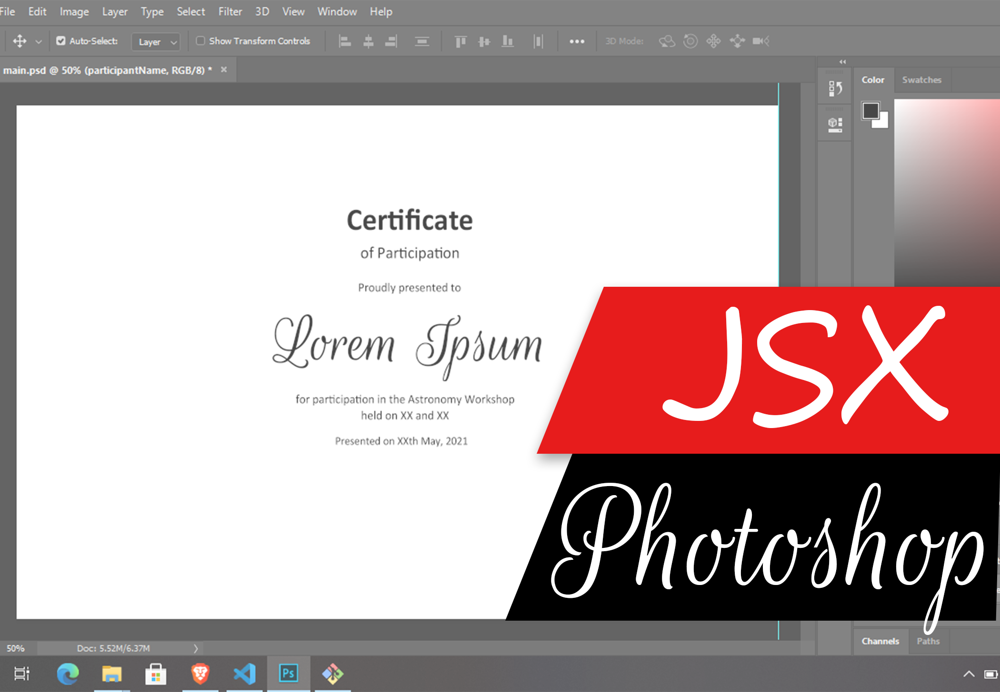
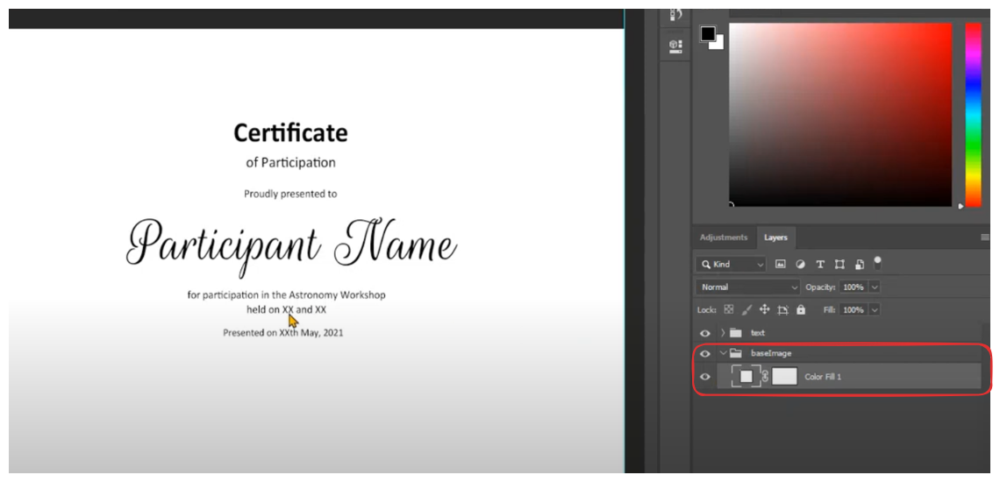
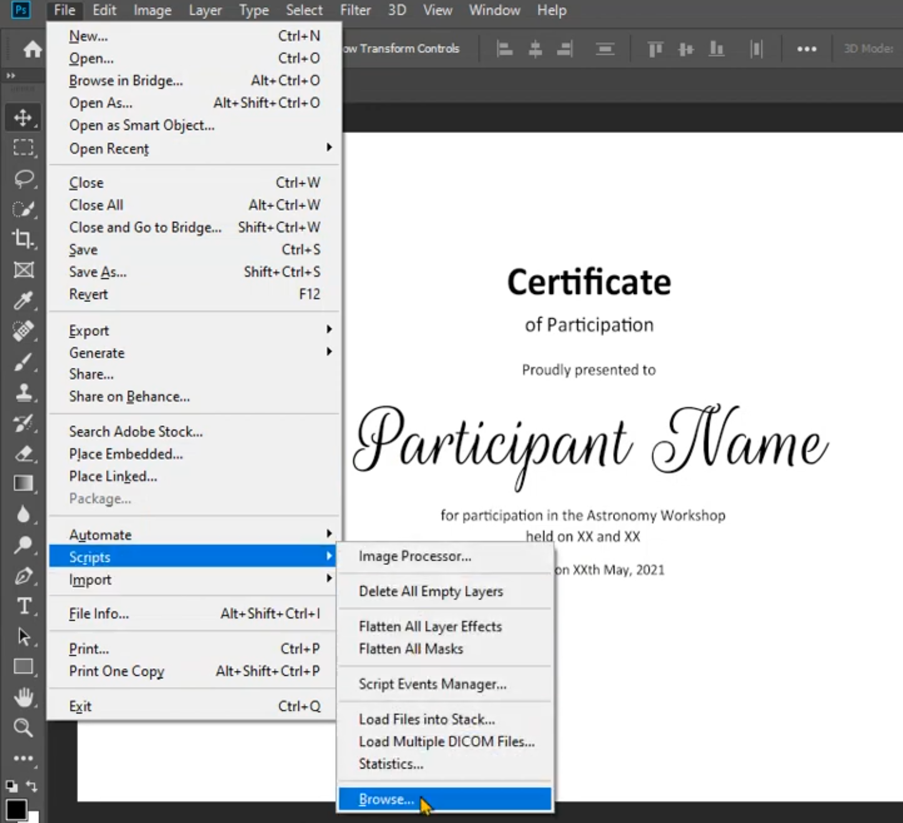

# photoshop-jsx
A JSX Photoshop CC 2019 based script for replacing images and text , also saves a .jpg file and a .psd file in the result folder. Takes text input from a .json file

1. [Video demo](#video-demo-click-image)
2. [How to use](#how-to-use)
3. [Customize](#customize)

# Video demo (Click Image)
[](https://youtu.be/qKsxW6evvdY "Youtube link showing how to replace texts in photoshop using this script")

# How to use

Say you want to generate Participant Certificates using this script in photoshop 2019 CC or similar:

1. Open photoshop and add folders/group with names "text" and "baseImage". 
2. Create the desired background for the Certificate inside the baseImage folder:


3. Inside "text" Title Group(or folder) add the "participantName" text layer and place it on the desired position and appropriate text size. We will use the script to change this text.

4. Download the script from https://github.com/avialxee/photoshop-jsx 

    by clicking Code > Download Zip

5. Unzip the folder to a desired location and copy your photoshop file inside the unzipped folder. If you dont wish to keep the Photoshop file inside the folder follow the Step 4 in [Customize](#customize) and proceed with the next steps.
6. Open `input.json` file in your favourite text editor and replace the values corrosponding to name. 
    ```json
    {
    "name": ["Avinash Kumar", "Lorem Ipsum"]
    }
    ```
7. Run the script following the [demo](https://youtu.be/qKsxW6evvdY "Youtube link showing how to replace texts in photoshop using this script") or follow the following:
    - File > Scripts > Browse and select the `autotype.jsx` file found in the unzipped folder.
    


# Customize

1. The group names can be changed according to your preference:

    Open `autotype.json` to find and change the `baseImage` to a desired group name. Similarly for the `text` group name.

2. If you dont want alerts each time an image is saved, comment the [line 49](https://github.com/avialxee/photoshop-jsx/blob/24713c40f18cceedc3afed4b791c439ea1804f0b/autotype.jsx#L49):
    ```json
    // alert("saved Jpeg");
    ```
    Similarly one can comment the next line if you dont wish to save the .psd files.
3. To change the output folder path change the following:
    ```jsx
    var outpath = thePath+'/output/';
    ```
4. If you wish to have a destination folder containing output somewhere separate from the photoshop file. Add the destination path to `thePath`.
    ```jsx
    var thePath = 'path/to/destination';
    ```
